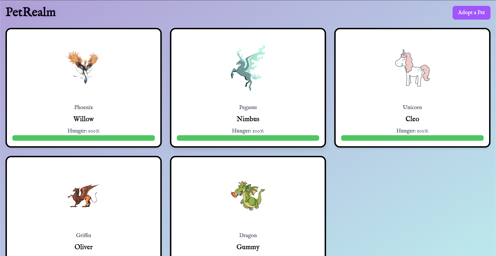
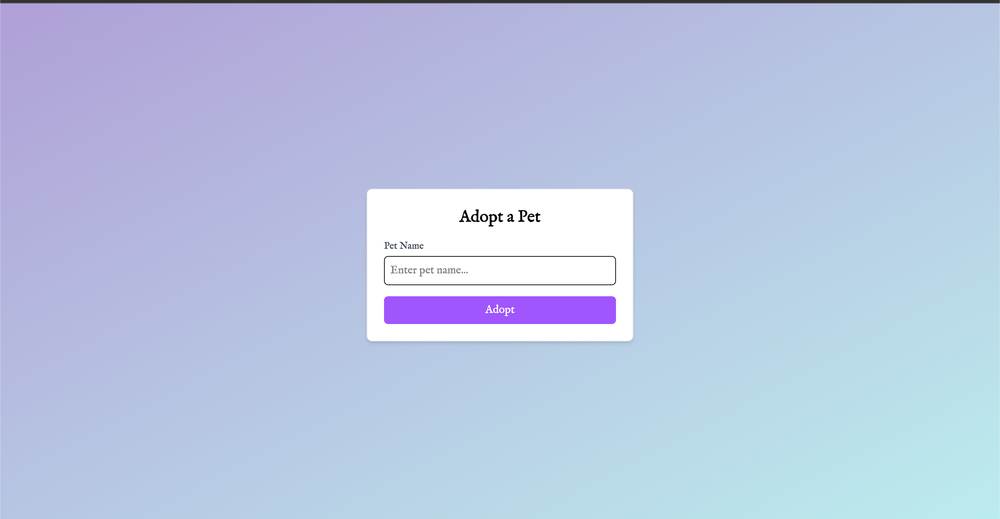

# 🐉 PetRealm

## Project Overview

PetRealm is a virtual mythical pet simulation where players can adopt, care for, and interact with magical creatures. Each pet has a hunger system that gradually decreases over time, encouraging regular feeding to keep them happy and healthy.

**Live Demo:** [PetRealm on Vercel](https://petrealm.vercel.app/)

  
  
  

---

## Tech Stack

### Frontend

- Next.js (React): Handles the UI with dynamic pages and components.

### Backend

- Node.js (Express.js): Provides API endpoints for pet interactions.
- AWS EventBridge + Lambda: Automates hunger decay with scheduled events.
- AWS CloudWatch: Monitors Lambda functions and logs system events.

### Database

- PostgreSQL (AWS RDS): Stores pet data with persistence across sessions.

### Deployment & CI/CD (in progress)

- Vercel: Current hosting platform for the frontend.
- Serverless Framework: Simplifies deployment of backend resources to AWS.
- AWS Amplify: In progress — migrating frontend hosting to Amplify with CI/CD.
